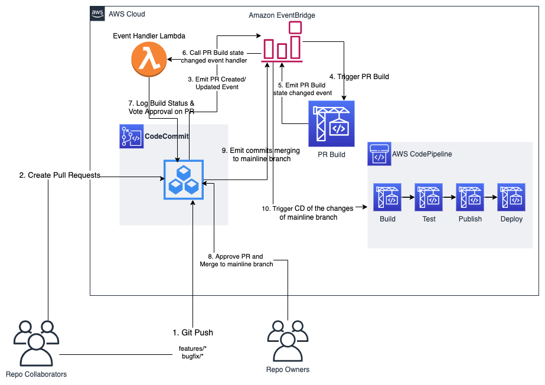

# AWS CodeCommit based devops model

AWS CodeCommit is a **managed**, **secure** and **git based** source code management service. AWS CodeCommit helps enterprise users to set up secure and managed SCM. Though it does not provide the social related features(such as forking and liking) in [Github][github] or [Gitlab][gitlab]. It can easily work like [Gerrit Code Review][gerrit] for team collobration in any size, which is thoroughly used by Android and the projects under Eclipse Foundation.

This best practice model consists of below guidelines and workflows,

- The Collaborator role of AWS CodeCommit repos who only has permissions for pulling repo, pushing/merging code to specific branches(the branch name with prefix `pr/`, `features/` and `bugs/`), and creating/closing/commenting pull requests.
- The Master/Owner role of AWS CodeCommit repos who has some additional administrative privilleges of repo, such as updating repo info, approving/merging pull requests.
- Nobody can directly push code to mainline branch including master/owner of repos.
- Any newly created pull request and updating of source branch of pull request will trigger automatically CodeBuild to verify the pull request. The CodeBuild will update the PR build status back to pull request and vote code review apporval `+1` if the build is successful.
- The approval rule template is created and assoicated with the repo. The approval rule requires at least two `+1` approvals from master/owner of repo and the automated PR build.
- The CodePipeline is created on watching the mainline branch of repo. When new changes are merged into mainline branch, the continuous delivery pipeline will be triggered to deploy the artifacts of repo.

See entire architecture below,



This model also leverages the Infra as Code capability of AWS via [AWS CDK][cdk]/[CloudFormation][cloudformation], hundreds or more code repositories and their collaboration workflow can be easily managed in a batch.

## How to deploy demo app

### Prerequisites

- Install Node LTS(such as 12.x)
- Configure your AWS account for [awscli](https://docs.aws.amazon.com/polly/latest/dg/setup-aws-cli.html)
  
### Deploy it
```shell
# build lambda function for cfn custom resource 'ApprovalRuleTemplate' and 'ApprovalRuleRepoAssociation', init cdk toolkit
npm run init

# deploy
npm run deploy
```

### Cleanup
```shell
npm run cleanup
```

## License

This sample code is made available under the MIT-0 license. See the LICENSE file.

[codecommit]: https://aws.amazon.com/codecommit/
[github]: https://github.com/
[gitlab]: https://about.gitlab.com/
[gerrit]: https://www.gerritcodereview.com/
[cdk]: https://aws.amazon.com/cdk/
[cloudformation]: https://aws.amazon.com/cloudformation/
